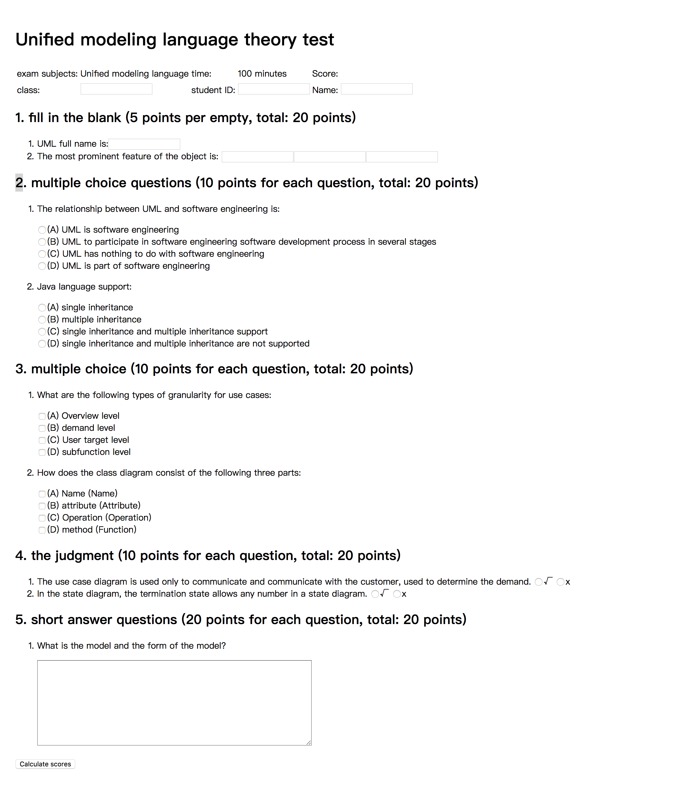

# Implement an Online Exam Page with HTML

## Business Requirement:
According to below prototype，please write HTML code in `index.html` to implement the an online exam page. 



## Practice Challenges:


* Understand and apply nested rules for HTML element tags.
* Distinguish and apply block-level elements and row-level elements rationally.
* Retrieve and apply the appropriate label for the corresponding functions.
* Comprehensive use of multiple HTML elements 
```
<section> <div> <li> <ul> <input> <table> etc.)
```


## Practice Requirements:

* Use the div / section tag to build the basic structure of the page.
* Use a different text label to display the text effect.
* Use different input tags to receive user input
Use the li tag to display the list.

## Practice Output:
Please push your practice repo to the site which the trainer will tell you.
The Repository should includes：
1. Implemented code
2. Screenshot after all code complettted

## Environment Require
Chrome

## How to begin：
git clone https://github.com/tws-online-quiz/html-make-online-exam-page
Stack Initial and build:
Open the index.html with browser, you will see the result of any change.

## Learning Resourse(Chinese Version):
[W3School](http://www.w3school.com.cn/)

